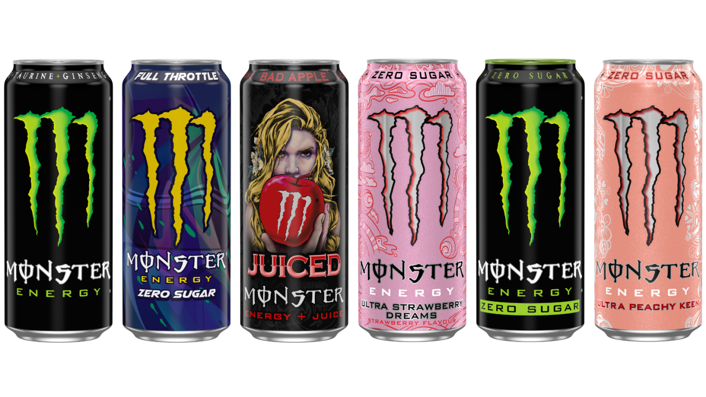

# Monster List and Ranking

## Introduction

Hello,

My name is Abel Chartier and I wanted to share my opinion on the
different Monsters I've been able to drink in my life. I'm a student
at EPITA and this idea came to me during my internship at CEA
Paris-Saclay at DES/DM2S/SGLS/LCAN.

MangoLoco-ly

--

Abel Chartier

ING2 2027 - CEA Intern

"Redbull gives you wings"

## Tastes

### Monster Energy

- [x] Monster Energy
- [ ] Monster Energy Zero Sugar
- [x] Lando Norris
- [ ] Nitro
- [ ] Top Speed
- [ ] Zero Sugar

### Monster Ultra

- [x] Ultra White (R)
- [x] Ultra Golden Pineapple
- [ ] Ultra Paradise
- [ ] Ultra Peach keen
- [ ] Ultra Fiesta Mango
- [ ] Ultra Watermelon
- [ ] Ultra Roba

### Juiced Monster

- [x] Mango Loco
- [x] Rio Punch (R)
- [ ] Aussie Lemonade
- [x] Pipeline Punch (R)
- [x] Mixxd
- [ ] Monarch
- [ ] Pacific Punch
- [ ] Khaotic
- [ ] Juice Monster Bad Apple

### Monster Rehab

- [x] Rehab Tea + Lemonade
- [x] Rehab Peach Tea

(R) - To retest

## Tierlist

| Tier | Taste                                        |
| ---- | -------------------------------------------- |
| S    | Lando Norris, Mango Loco                     |
| A    | Mixxd, Pipeline Punch, Rio Punch             |
| B    | Monster Energy, Rehab Peach Tea, Ultra White |
| C    | Rehab Tea + Lemonade                         |
| D    |                                              |
| E    | Ultra Golden Pineapple                       |
| F    |                                              |

## Reviews

### S Tier

#### Lando Norris

Refreshing melon and yuzu flavor. Good taste for a zero-sugar drink
with minimal artificial sweetener taste.

Pros:

- Nice melon flavor
- Doesn't feel as heavy as regular energy drinks

Cons:

- Slight aspartame aftertaste

#### Mango Loco

Classic tropical taste similar to Oasis drinks. Very easy to drink.

Pros:

- Familiar Oasis-like flavor
- Goes down easily

Cons:

- Very sweet, can be overwhelming

### A Tier

#### Mixxd

Supposed to be tropical fruit but has an unusual financier-like
taste. Still quite good.

Pros:

- Sweet and smooth
- Easy to drink
- Interesting flavor

Cons:

- Might be too sweet
- Not what you'd expect from a tropical Monster

#### Pipeline Punch

(To be retested)

#### Rio Punch

(To be retested)

### B Tier

#### Monster Energy

Strong, bitter taste that wakes you up well.

Pros:

- Bold, punchy flavor

Cons:

- Strong bitterness, can be hard to finish

#### Rehab Peach Tea

Decent Monster, nothing special. Tastes like iced tea at first then
sugar-free energy drink aftertaste. Pretty average.

Pros:

- Refreshing
- Reminds me of Estathè[^1]

Cons:

- Noticeable aspartame taste

[^1]:
    Estathè: Italian iced tea brand served in yogurt-like cups
    with a straw, very popular with kids

#### Ultra White

Strong, somewhat chemical taste with heavy aspartame aftertaste.

Pros:

- Not too sweet

Cons:

- Aspartame flavor
- Odd taste

### C Tier

#### Rehab Tea + Lemonade

Like the Rehab Peach Tea but lemon flavored and without the
nostalgic appeal.

Pros:

- Refreshing

Cons:

- Strong aspartame taste

### E Tier

#### Ultra Golden Pineapple

Tastes like bad medicine (pineapple fizzy tablets). Barely any real
pineapple flavor.

Pros:

- It's still a Monster

Cons:

- Bad taste
